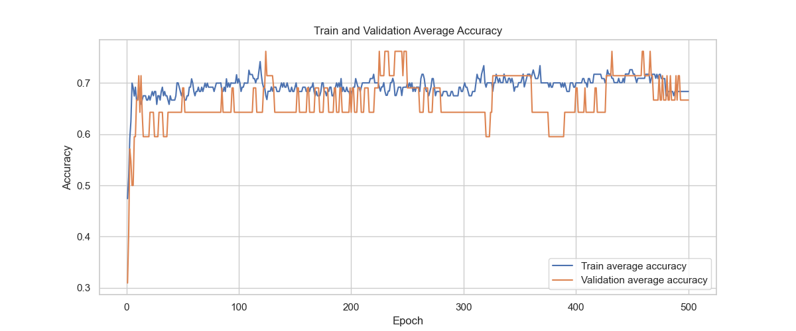

# 1-Dimensional CNN with Elastic Net Regularization for Diabetic Patient Classification using Raman Spectroscopy Data

## Introduction

In this project, I built a one-dimensional CNN neural network with elastic net regularization. The network was aimed at identifying diabetic patients based on Raman spectroscopy measurements.

On a personal level, the main purpose of this project was to achieve the following objectives:

1. Enhance my PyTorch skills.
2. Practice scalable and modular coding.
3. Gain experience in working with spectroscopy data.

Raman spectroscopy data used in this project was sourced from the study by Guevara et al. [2018]. The deep learning architecture's structure was based on the work of Feifei et al. [2022], specifically their article titled "A Shallow Convolutional Neural Network with Elastic Nets for Blood Glucose Quantitative Analysis Using Raman Spectroscopy."

## Data Preprocessing

Standard preprocessing steps were applied to all Raman spectroscopy samples. These steps include:

1. **Slicing of Raman Shift Data**: The data was sliced to the range of 800 to 1800 cm−1, known to match the spectral region of the advanced glycation end products (AGEs) [Guevara et al. [2018]].

2. **Baseline Correction**: The asymmetric least squares algorithm (Savitzky-Golay filter) was used to remove baseline noise from each Raman spectrum, improving spectral clarity.

3. **Remove Baseline from Original Spectrum**: The calculated baseline was subtracted from the original Raman spectrum to obtain the corrected spectrum.

4. **Normalization**: The corrected spectrum was normalized to bring the intensities within the range [0, 1]. This scaling operation ensures comparability between different spectra.

5. **Smoothing**: A Savitzky-Golay filter was applied to the normalized spectrum to smooth out noise and enhance important spectral features.

Figure 1: Labeled visualization of the Raman spectra dataset before stages 2 to 5 in the preprocessing pipeline.


## Neural Network Structure

The architecture of the neural network used in this project is depicted in Figure 2.

Figure 2: Neural network structure


## Intermittent Results
### Experiment Number 8

The training process began with low accuracy and high loss values, but as the training progressed, the model started to improve, and the accuracy on the validation set increased. The training log shows fluctuations in accuracy and loss over epochs, but the best model was saved at epoch 26, where the validation accuracy reached 83.33%. It's important to note that these fluctuations are observed in all runs and can be attributed to the very small dataset size of 20 samples (14 training and 6 validation). To obtain more reliable estimates of the model's performance, a cross-validation approach should be considered for the next steps.

Figure 3: Loss and accuracy plots of experiment 8 visualized by Comet


Figure 4: Loss and accuracy plots of experiment 8 visualized with Matplotlib


Figure 5: Average results of 7 cross validation accuracy scores - inner arm experiment 8  


## Results
The CNN architecture was trained and evaluated using Raman spectra collected from four different locations: the inner arm, earlobe, thumbnail, and vein. Due to the limited number of samples, and after evaluating intermittent results (refer to intermittent results), a cross-validation approach was applied to assess the outcomes (see main_cv.py).

While the architecture's results applied to the data collected from the inner arm and thumbnail exhibited a high level of fluctuation, the results from the data collected from the vein and especially the earlobe displayed more stable and consistent outcomes. The best results were presented in the Earlobe Experiment Numbers 5.8 and 5.9. In EL exp 5.8, a rapid increase in training and validation average accuracy is visible until approximately epoch 30. At this point, the model remained within the range of 60% to 70% accuracy until reaching its high point of 76% to 82% accuracy at epochs around 220 to 240.  

**Model 5.8 hyperparameters**  
'lr': 0.0003, 'batch_size': 7, 'epochs': 500, 'elasticnet': True, 'L1': 0.001, 'L2': 0.01  

**convolution layer**  
'out_channels':32, 'kernel_size': 10  

**Preprocessing**  
'start_wave': 800, 'end_wave': 1800, 'normalization': True  

Figure 6: Average results of 7 cross validation accuracy scores - Ear lobe experiment 5.8  


Model 5.9, with a higher batch size (10 vs. 7), exhibits greater stability but a lower peak in accuracy results (76% vs. 82%).

Figure 7: Average results of 7 cross validation accuracy scores - Ear lobe experiment 5.9  



Hyperparameters selection and adaptation was preformed manually based on results.

## Installation

To run the model, follow these steps:

1. Set up a virtual environment (recommended):
```bash
python -m venv myenv
source myenv/bin/activate   # On Windows, use `myenv\Scripts\activate`
```

2. Install the required packages using the `requirements.txt` file:
```bash
pip install -r requirements.txt
```

3. Create a Comet account and obtain your API key from [comet.ml](https://www.comet.ml/).

4. Replace the `API_KEY` in the script with your Comet API key.

## Hyperparameters

The hyperparameters used in the model are defined as follows:

```python
params = {
    # project settings
    'model': '1dCNN-withElasticNet',
    'dataset': 'innerArm.csv',
    'seed': 42,
    'checkpoint_path': project.checkpoint_dir / 'EL_CV5p5.pt',

    # Name used to identify experiment in comet
    'Exp_name': "15",

    # Model hyperparameters
    'lr': 0.0001,
    'batch_size': 4,
    'epochs': 500,
    'elasticnet': True,
    'L1': 0.007,
    'L2': 0.007,

    # convolution layer
    'out_channels': 32,
    'kernel_size': 20,

    # Preprocessing
    'start_wave': 800,
    'end_wave': 1800,
    'test_size': 0.3,
    'normalization': True
}
```

## Usage

To train the model, run the training script with the specified hyperparameters:

```bash
python main.py
```
or for cross validation
```bash
python main_cv.py
```

Please ensure that the `innerArm.csv`/'earLobe.csv' dataset is in the appropriate location or update the `params['dataset']` accordingly.


## License

This project is licensed under the [MIT License](LICENSE). You are free to use, modify, and distribute the code as per the terms mentioned in the license.


## References

1. Guevara, E., Torres-Galván, J. C., Ramírez-Elías, M. G., Luevano-Contreras, C., & González, F. J. (2018). Use of Raman spectroscopy to screen diabetes mellitus with machine learning tools. Biomedical Optics Express, 9(10), 4998–5010. [https://doi.org/10.1364/BOE.9.004998](https://doi.org/10.1364/BOE.9.004998)

2. Feifei Pian, Qiaoyun Wang, Mingxuan Wang, Peng Shan, Zhigang Li, Zhenhe Ma. (2022). A shallow convolutional neural network with elastic nets for blood glucose quantitative analysis using Raman spectroscopy. Spectrochimica Acta Part A: Molecular and Biomolecular Spectroscopy, Volume 264, 120229. [https://doi.org/10.1016/j.saa.2021.120229](https://doi.org/10.1016/j.saa.2021.120229)

## Acknowledgment

Inspiration for project structure: https://github.com/FrancescoSaverioZuppichini/PyTorch-Deep-Learning-Template

## Contact

If you have any questions, suggestions, or feedback, you can reach out to me via email or open an issue on GitHub. I would be happy to hear from you!

